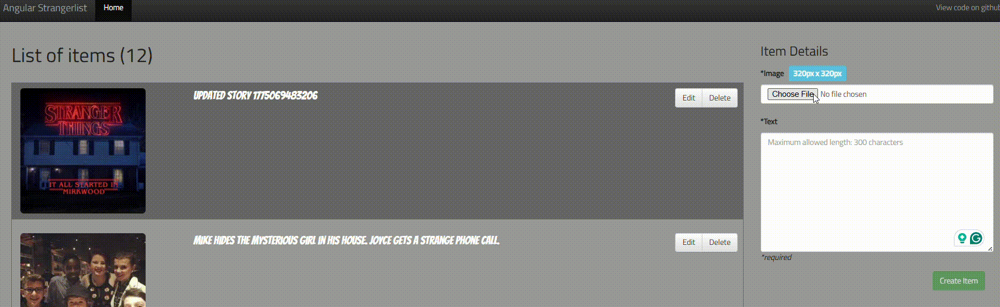
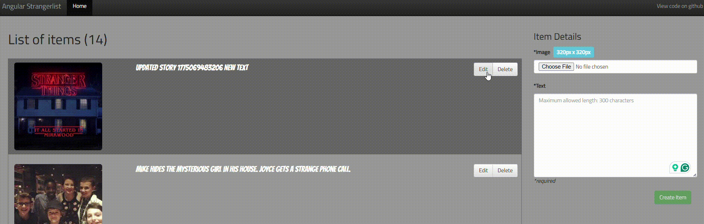
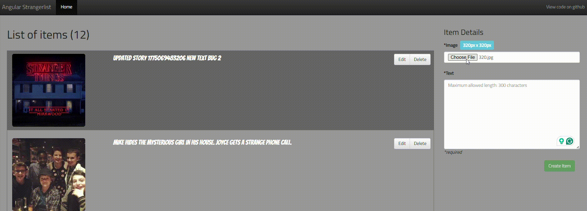

# Bug Report - Strangerlist Automation Challenge

This document details the defects identified during the testing cycle. Each report includes reproduction steps, expected vs. actual results, and dynamic evidence (GIFs) to facilitate debugging.

---

## 1. BUG-001: File Input Not Reset After Successful Creation
**Severity:** 🟠 Major  
**Priority:** High

### **Description**
When a user creates a new item, the text area is cleared, but the "Choose File" input remains populated with the previously uploaded image path/file name.

### **Steps to Reproduce**
1. Go to the main application page.
2. Select a valid image using the "Choose File" control.
3. Enter a unique description in the "Text" field.
4. Click the **"Create Item"** button.
5. Wait for the item to appear in the list.

### **Expected Result**
All form fields (both text and file input) should be reset to their default empty state after a successful creation to allow for a clean new entry.

### **Actual Result**
The "Text" field is reset, but the file input still displays the name of the uploaded image.

### **Evidence**

---

## 2. BUG-002: Update Image Functionality Not Working
**Severity:** 🔴 Critical  
**Priority:** Highest

### **Description**
During the edit flow, if a user selects a new image and modifies the text, the system only persists the text change. The original image remains unchanged in the database and UI.

### **Steps to Reproduce**
1. Locate an existing item in the list and click **"Edit"**.
2. Select a different image file using the file input.
3. Modify the text in the description field.
4. Click the **"Update Item"** button.
5. Verify the updated item in the list.

### **Expected Result**
The system should update both the text description and the associated image file in the storage and the UI.

### **Actual Result**
Only the text is updated. The item still displays the old image, failing to update the binary/reference data.

### **Evidence**

---

## 3. BUG-003: Missing Success Feedback for CRUD Operations
**Severity:** 🔵 Minor  
**Priority:** Low

### **Description**
The application provides no visual feedback (toast, snackbar, or alert) to confirm that an item was successfully created or updated, leaving the user uncertain about the operation's status.

### **Steps to Reproduce**
1. Perform a "Create" or "Edit" operation on any item.
2. Observe the UI behavior immediately after clicking the submit button.

### **Expected Result**
A clear success message (e.g., "Item created successfully!" or "Changes saved!") should appear to confirm the action was processed.

### **Actual Result**
The list refreshes, but no success notification is displayed to the user.

### **Evidence**

---

## Quality Assurance Notes
* **UI/UX Standards:** Bug 3 is reported as a violation of the "Visibility of System Status" principle. A professional application must always keep the user informed about the outcome of their actions through immediate visual feedback.
* **Test Environment:** All defects were verified using the production Heroku environment and emulated mobile devices.